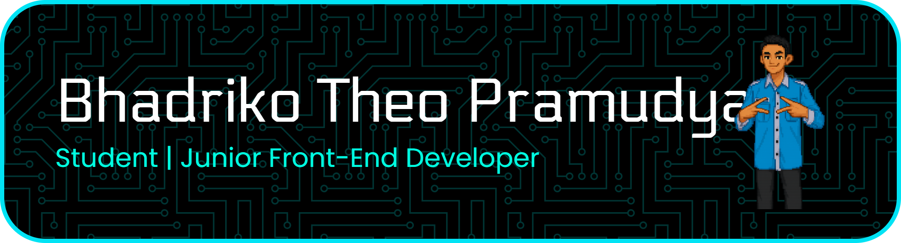

<h1 align="center">Halo Manusia Saya Bhadriko</h1>
<h3 align="center">Bachelor of Informatics Engineering Student Universitas Komputer Indonesia (UNIKOM)</h3>

  

- 🔭 I’m currently working on **Ruangin**

- 🔭 I’m currently working on **MSIA**

- 📫 How to reach me **bhadriko7@gmail.com**

- ⚡ Fun fact **I think i'm cool**

<h3 align="left">Connect with me:</h3>

---

<h3 align="left">Tools</h3>

---

<h3 align="left">Programming Language Framework </h3>

---

### Bhadriko GitHub Stats:
 
 

---

### 🔝 Top Contributed Repo

---

